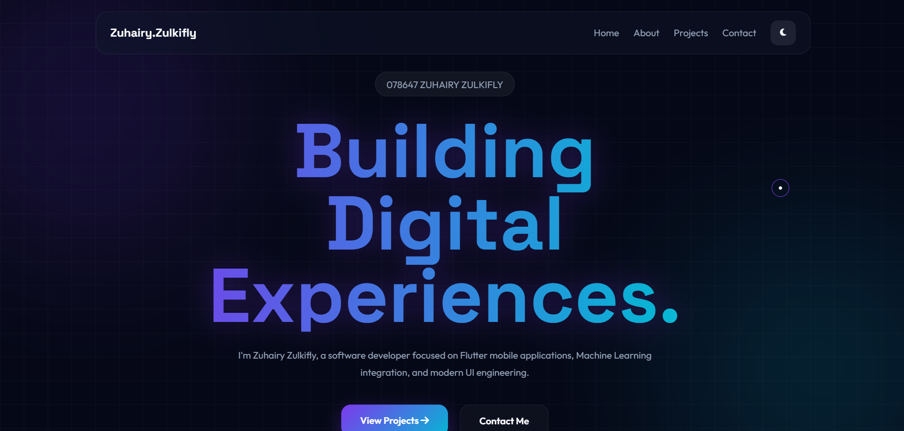

# Zuhairy Zulkifly – Premium Portfolio

## Description

This portfolio website was developed to showcase my expertise in mobile application development, Artificial Intelligence (AI/ML) integration, and software engineering practices. The portfolio features a modern Bento Grid and Glassmorphism-inspired user interface designed to provide a premium and futuristic user experience.

This project was developed as part of the CSD34203 Special Topics in Software Development course.

---

## Features

* Premium Bento Grid user interface
* Glassmorphism-inspired design elements
* Dark and Light Mode toggle
* Fully responsive layout for desktop and mobile devices
* Smooth scrolling animations using AOS
* Interactive magnetic hover effects
* Project showcase section
* Downloadable APK integration via GitHub Releases
* Contact and social media links

---

## Technologies Used

* HTML5
* CSS3
* JavaScript (Vanilla JS)
* AOS (Animate On Scroll)
* Font Awesome
* Google Fonts
* Git & GitHub
* GitHub Pages

---

## Project Structure

```text
my-personal-blog/
│
├── images/
│   ├── gambaraku.png
│   └── home.png
│
├── .gitignore
├── index.html
├── style.css
└── README.md
```
---

## Screenshots

### Home Page



---

## Featured Projects

### SmartTacts – AI-Powered Futsal Tactical Assistant

SmartTacts is an AI-powered futsal tactical support system designed to help coaches analyze opponents' previous performance data and prepare tactical strategies for upcoming matches. The system utilizes machine learning models to provide tactical recommendations based on historical match statistics.

**Technologies Used:**

* Flutter
* Dart
* Python
* Scikit-learn
* Firebase
* Ubuntu Server

### DuitMate – Housemate Expense Manager

A mobile application designed to simplify expense management among housemates by tracking shared expenses, calculating balances, and improving financial transparency.

**Technologies Used:**

* Flutter
* Firebase
* Dart

---

## How to Run the Project

### Clone the Repository

```bash
git clone https://github.com/Zuhairy-Zulkifly/blog
```

### Open the Project

Navigate to the project folder and open:

```bash
index.html
```

using any modern web browser.

Alternatively, deploy the project using GitHub Pages.

---

## Challenges Faced

* Maintaining responsive Bento Grid layouts across different screen sizes.
* Implementing magnetic hover interactions without affecting button functionality.
* Balancing premium visual effects with website performance.
* Ensuring smooth theme switching between dark and light modes.

---

## Solutions Implemented

* Applied CSS Grid and media queries for responsive layouts.
* Used pointer-events and z-index management to prevent interaction conflicts.
* Optimized JavaScript animations to reduce rendering overhead.
* Utilized localStorage to preserve user theme preferences.

---

## Future Improvements

* Add multilingual support.
* Integrate project filtering and search functionality.
* Enhance accessibility compliance.
* Implement dynamic project loading using JSON data.

---

## Live Demo

https://zuhairy-zulkifly.github.io/blog/ 

---

## Author

### Zuhairy Zulkifly

Final Year  Student in Software Development at UniSZA Besut

**Areas of Interest:**

* Flutter Mobile Development
* Artificial Intelligence & Machine Learning
* Software Engineering
* System Architecture (SDLC)
* UI/UX Engineering
